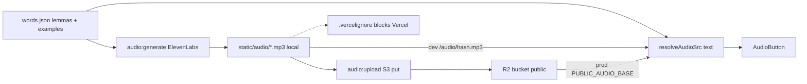

# ElevenLabs audio for dictionary words and phrases

## Decisions (locked)

- **Scope now (B):** all dictionary lemmas (~3k) + example Slovak strings (~6k rows / ~5.9k unique).
- **Scope later (C):** lesson dialogue / key phrases / practice cues (hooks already exist via `AudioCue.src`).
- **Local:** MP3s under gitignored [`static/audio/`](static/audio/) so Astro serves them as `/audio/...` in `bun run dev` / local preview (`publicDir: "./static"` in [`astro.config.ts`](astro.config.ts)).
- **Vercel:** do **not** bill bandwidth for the library — exclude via [`.vercelignore`](.vercelignore) (and keep files out of git). Public site plays from R2.
- **Public:** serve from a **dedicated R2 bucket** for slovak.wiki (same CF account as flags.games is fine; storage ~0.3–0.6 GB expected — well under R2’s 10 GB free). Zero egress is the right model for listen-heavy learning traffic.
- **Key:** use existing `ELEVENLABS_API_KEY` from `.env` (already gitignored via `.env*`).
- **Future TTS:** design so provider is swappable (hash includes provider id); custom/local model is Phase D, not this build.

## Local static + Vercel ignore (updated)

Same pattern as Pagefind (`static/pagefind/` already gitignored):

1. Generate into `static/audio/{hash}.mp3`
2. Add `static/audio/` to [`.gitignore`](.gitignore) — never commit the library
3. Add [`.vercelignore`](.vercelignore):
   - `static/audio`
   - `dist/audio` (covers local `astro build` then CLI deploy where Astro already copied public assets into the output)

**Why both gitignore + vercelignore:** git builds on Vercel never see the files. `.vercelignore` protects `vercel` CLI deploys from a machine that already ran `audio:generate` / local build.

Production URLs still come from R2 (`PUBLIC_AUDIO_BASE_URL`). Local/dev with no base URL uses relative `/audio/${hash}.mp3` so the gitignored static tree works without uploading first.

## Storage research → pick

| Option                  | Fit                                                   | Verdict                                                  |
| ----------------------- | ----------------------------------------------------- | -------------------------------------------------------- |
| **Cloudflare R2**       | 10 GB free, **$0 egress**, S3 API, you already use it | **Use this** — new bucket `slovak-wiki-audio`            |
| Backblaze B2 + CF CDN   | Cheapest storage; free egress only via CF partnership | Fallback if account storage pressure becomes real        |
| Tigris                  | 5 GB free, $0 egress, global                          | Fine alt; no existing setup                              |
| UploadThing             | ~2 GB free, upload-app DX                             | Wrong tool for bulk static TTS library                   |
| Vercel egress for audio | Easy if shipped in deploy                             | **Blocked** via gitignore + `.vercelignore`; R2 for prod |

**Public URL:** R2 custom domain preferred (`audio.slovak.wiki` or similar) once DNS ready; until then R2 public `r2.dev` URL via `PUBLIC_AUDIO_BASE_URL`.

If flags.games is near the **shared account** free-tier storage/ops limits, still prefer a separate bucket on the same account first (this library is small). Only switch to B2+CDN if dashboard shows real pressure after upload.

## Architecture



**Content-addressed files** (dedupe shared phrases across lemmas):

`{sha256(provider|voiceId|modelId|normalizedSlovak).slice(0,20)}.mp3`

Committed config only (small):

- [`content/audio/config.json`](content/audio/config.json) — `provider`, `voiceId`, `modelId` (e.g. `eleven_multilingual_v2`), stability/speed, language hint
- [`content/audio/manifest.json`](content/audio/manifest.json) — map hash → `{ text, bytes, generatedAt }` for coverage / skip-if-exists (not per-word URL spam in `words.json`)

Runtime:

```ts
resolveAudioSrc(slovak: string): string | undefined
// prod: `${PUBLIC_AUDIO_BASE_URL}/${hash}.mp3`
// local (no base): `/audio/${hash}.mp3`  // served from static/audio
```

[`AudioButton.svelte`](src/lib/components/AudioButton.svelte) already prefers `src` over browser TTS — keep that fallback when hash missing or 404.

## Implementation steps

### 1. Audio pipeline scripts

Add [`scripts/audio/`](scripts/audio/) (mirror dictionary script layout) + document in [`scripts/README.md`](scripts/README.md):

| Script           | Job                                                                                                                     |
| ---------------- | ----------------------------------------------------------------------------------------------------------------------- |
| `audio:generate` | Collect unique lemma + example Slovak strings; skip existing hashes in `static/audio/`; call ElevenLabs TTS; write MP3s |
| `audio:upload`   | Sync `static/audio/` → R2 via S3-compatible API                                                                         |
| `audio:status`   | Counts: total unique texts, generated locally, uploaded (manifest), missing                                             |

Flags: `--limit N`, `--lemmas-only`, `--dry-run`, `--force` (regen). Rate-limit / retry on 429.

Env (local `.env`, never commit):

- `ELEVENLABS_API_KEY` (have)
- R2: `R2_ACCOUNT_ID`, `R2_ACCESS_KEY_ID`, `R2_SECRET_ACCESS_KEY`, `R2_BUCKET`, `PUBLIC_AUDIO_BASE_URL`

Ignore wiring:

- [`.gitignore`](.gitignore): `static/audio/`
- [`.vercelignore`](.vercelignore): `static/audio` + `dist/audio`

### 2. Voice gate (before bulk spend)

Per existing plan in [`docs/plans/2026-08-01-lessons-practice-implementation-plan.md`](docs/plans/2026-08-01-lessons-practice-implementation-plan.md):

1. Pick one solo Slovak-capable voice; write id into `content/audio/config.json`
2. Generate ~10 sample clips (short lemma + longer sentence with diacritics)
3. Manual listen check → then full `audio:generate`

Rough TTS cost driver: ~250k–400k characters for full B corpus (plan quota / paid tier accordingly; free 10k chars/mo will not finish the library).

### 3. Site wiring (dictionary)

- Helper: [`src/lib/content/audio.ts`](src/lib/content/audio.ts) — hash + `resolveAudioSrc` (local `/audio` vs R2 base)
- [`EntryDetail.svelte`](src/lib/components/EntryDetail.svelte): `AudioButton` next to headword and each example Slovak line
- Do **not** add audio fields into giant `words.json` — deterministic URLs keep content scripts simple
- Client only sees `PUBLIC_AUDIO_BASE_URL` (optional); no secret keys in client

### 4. Local + public workflow

```text
bun run audio:generate   # → static/audio/ (local /audio/... in dev)
bun run audio:upload     # → R2 for production
```

Prod Vercel env: set `PUBLIC_AUDIO_BASE_URL` to the R2 public base. Leave unset locally to use `/audio/...`.

### 5. Phase C (later, same stack)

- Fill `audio.src` on lesson cues in [`src/lib/content/lessons.ts`](src/lib/content/lessons.ts) via same hash helper
- Dialogue: second voice id in config for speaker B; PracticePlayer already reads `line.audio?.src`

### 6. Phase D (future TTS model)

Keep `provider` in the hash key and a thin `synthesize(text) → ArrayBuffer` interface in the generate script. Swap ElevenLabs for a local/self-hosted model without changing UI or R2 layout.

## Out of scope this pass

- Tatoeba-hosted audio (license; already called out in frequency/Tatoeba design docs)
- Committing MP3s or serving them from Vercel in production
- Building a custom TTS model
- Full lesson/practice audio generation (C) — after dictionary B is proven

## Acceptance checks

- Local `bun run dev`: headword + examples play from `/audio/...` when files exist under `static/audio/`
- Production: plays from R2 when `PUBLIC_AUDIO_BASE_URL` set
- Missing clip → browser `sk-SK` TTS still works
- `static/audio/` gitignored; `.vercelignore` excludes `static/audio` and `dist/audio`; secrets never in git
- `audio:generate --limit 20` idempotent; re-run skips existing hashes
- Manifest coverage report matches unique Slovak strings in live dictionary
