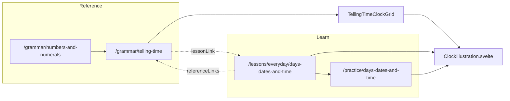

# Telling time + lite clocks

## Locked decisions

| #   | Decision                                                                                        |
| --- | ----------------------------------------------------------------------------------------------- |
| 1   | Reference stays under **Grammar** — no `/numbers` top-level nav                                 |
| 2   | Sibling slug `/grammar/telling-time` (flat `GrammarTopic`). Nesting reserved for cases          |
| 3   | Hub `/grammar/numbers-and-numerals` gains `telling-time` in `related`                           |
| 4   | Shared presentational `ClockIllustration` SVG — no drag-drop, no scrub dial in v1               |
| 5   | Grammar clock grid = **slug-conditional** (alphabet precedent) — no `GrammarTopic.visual` field |
| 6   | Lesson teach visual + optional `clock` on choice options — small additive schema only           |
| 7   | Deepen `everyday/days-dates-and-time`; do not add a second time lesson in v1                    |
| 8   | Interaction = look-and-match (Mondly-inspired faces on choices), not drag                       |

## Why this IA

Site already splits Lessons (learn) vs Grammar/Pronunciation (lookup). Numbers topic lives under Nouns; clock time is also Sentences-y (`o`+locative, agreement). Flat sibling fits `GrammarTopic` / search / related links. Cases are the only nested special case.

Cheat-sheet refs already = grammar pages. Only visual precedent = `SlovakAlphabetIllustration` on pronunciation. Clocks = second visual pattern, reusable later.

## Architecture



## Source coverage

Checked against [coLanguage](https://wiki.colanguage.com/telling-time-slovak) + [Omniglot](https://www.omniglot.com/language/time/slovak.htm) (+ earlier e-slovak / slovake / Mondly).

| Topic                                             | v1                   | Where                                                                   |
| ------------------------------------------------- | -------------------- | ----------------------------------------------------------------------- |
| `čas` / `hodina` / `minúta` (+ sekunda one-liner) | Yes                  | rule + pattern; sekunda → numbers hub, not full paradigm                |
| 1 / 2–4 / 5+ agreement on hodina                  | Yes                  | core rule + grid 1:00 / 3:00 / 5:00                                     |
| `Koľko je hodín?` + Je/Sú                         | Yes                  | rule + examples                                                         |
| Looking-ahead `pol` + ordinal gen.                | Yes                  | rule + watchOut + grid/lesson                                           |
| **Always `Je` with pol** (never Sú)               | **Fold in**          | watchOut / lookFor (coLanguage trap)                                    |
| `štvrť na` / `trištvrte na` (looking ahead)       | Yes                  | rule + termSections + quarter exercise                                  |
| Spelling `trištvrte` (one word)                   | Yes                  | site skill + learner cheat sheets; not Omniglot/coLanguage “tri štvrte” |
| `štvrť na jednu` (acc. f. for 1)                  | **Fold in**          | one example/watch note (Omniglot); prefer _jednu_ over _jeden_          |
| Minutes past (`X a Y minút`) / to (`o Y minút X`) | **Fold in lightly**  | one rule paragraph + 2 examples — not full drill                        |
| Digital read (`sedem päťdesiatšesť`)              | Brief                | same 24h / formal paragraph                                             |
| `o` + locative; `okolo` + approx                  | Yes / **fold okolo** | rule + one pattern line `okolo piatej`                                  |
| Dayparts ráno / popoludní / večer / v noci        | Yes                  | 12h vs 24h + lesson already has days                                    |
| `poludnie` / `polnoc`                             | **Fold in**          | grid captions for 12:00 / 0:00                                          |
| Full 1–12 half/quarter tables                     | No                   | representative faces only (lookup refs exist)                           |
| `Máš čas?` / `Ako neskoro je?`                    | No                   | conversational; later or numbers lesson                                 |
| Yesterday / today / tomorrow list                 | Partial              | already in days lesson scene; no duplicate table                        |
| Dialog + writing exercises                        | No                   | lesson scene + choice/build enough for v1                               |

## Content outline — `/grammar/telling-time`

- `pathGroup: "Sentences"`, `order: 8`
- `slovak: "koľko je hodín"`, `english: "telling time"`
- `lessonLink` → days-dates-and-time
- Rules (5 short paragraphs):
  1. Je/Sú + hodina/hodiny/hodín by number group (same pattern for minúta; sekunda → numbers hub)
  2. Looking-ahead pol / štvrť na / trištvrte na; **Je pol…** only
  3. Minutes: past = `X hodín a Y minút`; to = `o Y minút X` (2 examples)
  4. Appointments: `o` + locative; approx `okolo piatej`
  5. 12h + daypart vs 24h / digital shortcut; `poludnie` / `polnoc`
- `watchOut`: pol tretej = 2:30 not 3:30; štvrť na jednu (not _jeden_) at 12:15
- `related`: numbers-and-numerals, questions, kolko
- Wire `questions.nextSlug = "telling-time"` (questions currently has no nextSlug)
- Grid faces: 1:00, 3:00, 5:00, 2:15, 2:30, 2:45, 12:00 (poludnie), 0:00 (polnoc) — drop 15:00 face; cover 24h in prose + one example instead (keeps grid = 8 faces, all analog-clear)

## Schema (minimal)

```ts
// learning-types.ts only
export interface ClockTime {
  hour: number; // 1–12 face
  minute: number;
}

export interface LessonVisual {
  type: "clock-grid";
  title: string;
  items: Array<{ time: ClockTime; slovak: string; english: string }>;
}

// Lesson.visual?: LessonVisual
// ChoiceExercise.choices[].clock?: ClockTime
```

No `GrammarTopic` schema change.

## File list

**New**

- `src/lib/components/ClockIllustration.svelte`
- `src/lib/components/TellingTimeClockGrid.svelte`

**Edit**

- `src/lib/content/data.ts` — topic + hub related + questions.nextSlug
- `src/lib/components/GrammarTopicDetail.svelte` — slug slot + rail link
- `src/lib/content/learning-types.ts` — ClockTime / LessonVisual / optional clock
- `src/lib/content/lessons.ts` — visual, clocks on choices, `days-quarter-time`, ref links
- `src/lib/content/practice.ts` — clocks + `everyday/quarter-time` + set itemIds
- `src/lib/pages/LessonPage.svelte` — visual section after pattern, before practice
- `src/lib/components/lessons/LessonInteraction.svelte` — clock in choice buttons
- `src/lib/components/practice/PracticePlayer.svelte` — same
- `src/lib/content/content.test.ts` — telling-time + visual/clock invariants

## Out of scope (v1)

- Full 1–12 Omniglot/coLanguage tables (link learners to examples, not dump)
- Ordinals / dates deep-dive pages
- Dedicated minutes-to/past practice set (prose + 2 examples only)
- `Máš čas?` / `Ako neskoro je?` phrase block
- Drag-drop matching, scrubbable dial
- New top-level `/numbers` or `/grammar/numbers/*` nest
- New lesson beyond deepening days-dates-and-time
- Audio generation for new clock phrases
- Clock faces on build/typed/cloze

## Implementation order

1. ClockIllustration (verify 12:00, 3:00, 2:30, 2:45 hour-hand drift)
2. Grammar topic + hub/nextSlug wiring
3. TellingTimeClockGrid + GrammarTopicDetail slot
4. learning-types optional fields
5. LessonPage visual section + lesson data
6. Clock on choices (lesson + practice UI)
7. Quarter exercise + practice item
8. Tests, format, index:search, smoke

## Verification

```bash
bun run test
bun run check
bun run format
bun run index:search
bun run dev
```

Manual: `/grammar/telling-time`, `/grammar/numbers-and-numerals` related link, `/lessons/everyday/days-dates-and-time` (visual + clock choices @ 560px), `/practice/days-dates-and-time` (4 items).

Tests: `entryBySlug.has("telling-time")`; hub related contains it; lesson visual ≥4; every `clock` hour 1–12 minute 0–59; practiceSets length stays **10** (item added to existing set, not new set).
